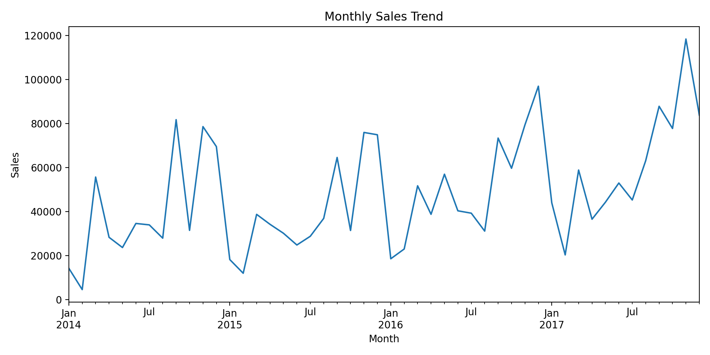

# Sales Performance Analysis (Python)

This project analyzes a retail Superstore dataset using Python to identify monthly sales trends through data cleaning, aggregation, and visualization.

## Tools & Libraries
- Python 3
- pandas
- matplotlib

## Project Structure
- data/ # Raw dataset
- src/ # Python analysis scripts
- outputs/ # Generated figures

## Analysis Performed
- Loaded and cleaned sales data
- Converted date and numeric fields
- Aggregated monthly sales
- Visualized sales trends over time

## Output
- Monthly sales trend line chart

## Results Preview



## Key Insights
- Sales show clear seasonality with peaks toward year-end
- Overall sales trend increases over time
- Monthly aggregation helps reveal long-term performance patterns

## How to Run
```bash
pip install pandas matplotlib
python src/main.py

## Dataset
Sample Superstore dataset (public retail dataset)
